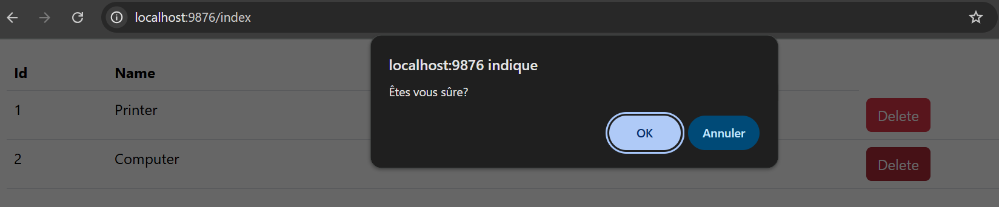
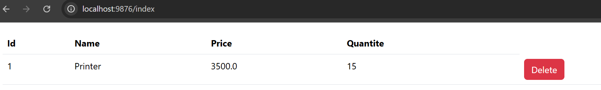
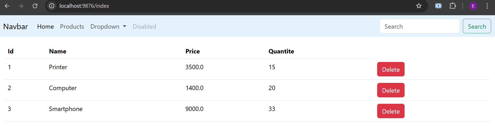
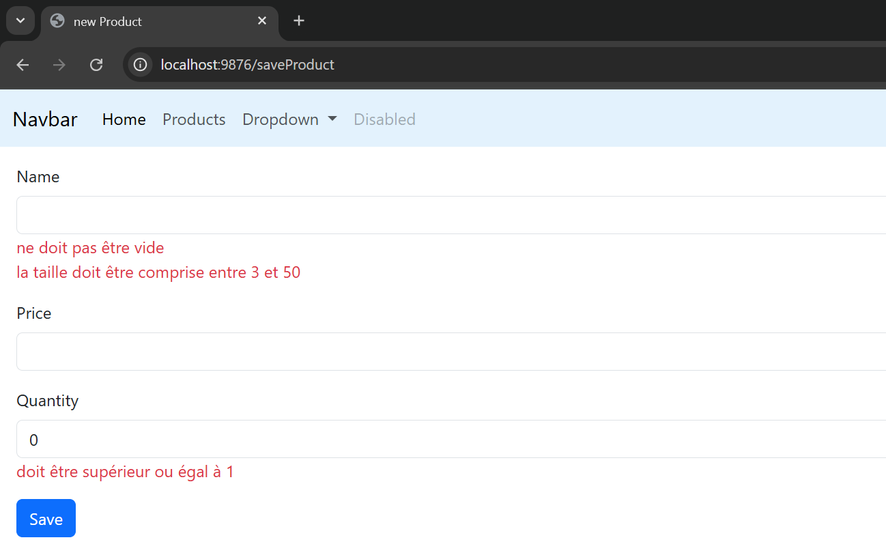
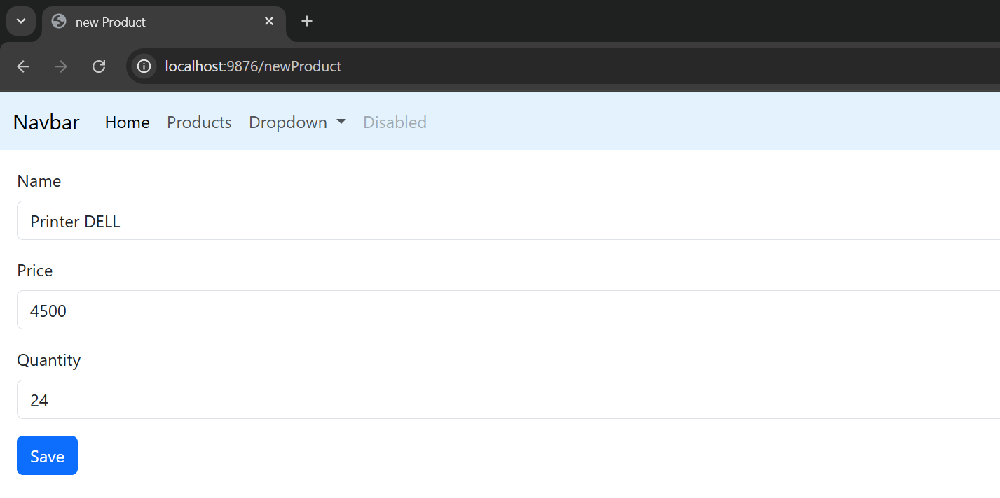
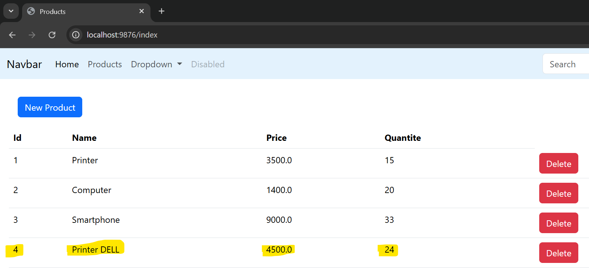

<h2>Application JEE</h2>
<h3>Créer une application Web JEE basée sur Spring, Spring Data JPA, Hibernate, Tymeleaf et Spring Security qui permet de gérer des produits</h3>
<h4>Tester la couche DAO</h4>

<h4>Consultation H2 Console</h4>

<h3>Création le contrôleur spring MVC et les vues thymeleaf</h3>
<h4>Affichage la liste des produits</h4>

<h4>Suppression d'un produit</h4>

<h4>Ajout d'une page template</h4>

<h4>Ajout un nouveau produit avec la validation du formulaire</h4>

